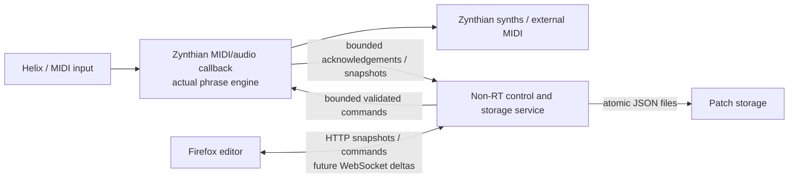

# Issue #7: architecture audit and desktop feasibility spike

Status: M0, against the **unmerged** PR stack #8 → #10 → #13 → #14 → #15
(v1.27.1, JSON schema 7). Recheck the merged schema and instance limits before
starting the production migration. No deployment or Zynthian compatibility claim.
The existing REAPER files stay unchanged by this spike.

## What the current engine actually owns

| Component | Current implementation | Migration consequence |
| --- | --- | --- |
| Scheduler | JSFX `@block`, sample-offset `midirecv`/`midisend`, free-time recorded event offsets; LOOP transport and 12 overlapping ONCE/HOLD voices | Keep scheduling in the host MIDI/audio callback, never browser timers. Host must supply sample rate, block size and tempo. |
| Phrase transforms | Non-destructive per-voice TIME DECAY and velocity gain; original event pool; phrase switch/choke/reset policies | Reuse tested EEL2 first; a native rewrite would need behavioral equivalence tests. |
| Ownership | Input counters, per-Instrument live/phrase output ledgers, ONCE references, sustain, mono and ARP state, targeted STOP/PANIC | Stable IDs and a typed command boundary must retain ownership and deterministic visible order. Remove/re-route commands need DSP acknowledgements. |
| Collections | 16 phrases, sparse 16 Smart Switch slots, sparse 8 full Instrument panels; six Transformer positions per panel | Bounded collections in engine, banks and JSON, not unlimited browser objects. Fresh creation IDs protect reused slots. |
| Transformers | Independent stateless transpose/range/velocity and CC instances; visible serial note order and deterministic CC last writer | Keep one ARP/polyphony instance per panel until a serial stateful ownership design is proven. |
| UI | Custom JSFX `@gfx`, modal frame shielding, separate GUI scratch; Smart Switch draft commit/cancel | Reimplement browser presentation and pointer behavior. Do not execute `@gfx` remotely or make it a timing thread. |
| Learn | One listener across switches, expression controllers and phrases; channel/type/number ownership and explicit conflict reassignment | Engine owns listener and capture. Remote session owns a cancellable edit lease, not its own MIDI listener. |
| Persistence | Frozen legacy prefix and appended schema-2…7 tables; two banks; Lua gmem command/ack handshake; versioned full-precision project snapshots | REAPER JSON remains canonical interchange. Port the Lua worker's responsibilities to a non-RT service, not the callback. |
| Regression host | Actual ysfx/WDL EEL2, MIDI and LICE; 2,289 checks, three concurrent renderer cases; four Lua tests | Retain REAPER coverage and add headless callback tests around the same engine source. |

## Hosting options checked

Audit dependency: `jpcima/ysfx` commit
`8077347ccf4115567aed81400281dca57acbb0cc` (Apache-2.0; audit bundled dependencies
separately before distribution). `cmake.plugin.txt` requests **VST3 and AU**, not
LV2. `ysfx.h` exposes a hosting API and `ysfx_compile_no_gfx`; WDL includes ARM and
AArch64 assembly/glue. That is source-level feasibility evidence, not a successful
Pi build, installed Zynthian engine or latency result.

| Route | Evidence and constraint | Recommendation |
| --- | --- | --- |
| Stock ysfx LV2 in Zynthian | This checkout has no LV2 plugin. Installed Zynthian image/plugins have not been inspected. | Do not assume it exists. Verify the actual kit first. |
| Native wrapper around ysfx, then LV2 adapter | Library runs this exact JSFX headlessly on desktop. Requires an LV2 MIDI atom adapter, URID mapping, sample clock/tempo, state worker, plugin metadata/discovery. | Preferred first production prototype; reuse tested behavior and avoid a full rewrite. |
| Standalone ysfx host with JACK/ALSA MIDI | Feasible alternative to LV2; requires Zynthian service/chain integration and port management. | Fallback if an LV2 chain introduces unnecessary coupling. Benchmark both on Pi. |
| Full native engine rewrite | No demonstrated parity yet. Highest scheduler/ownership/persistence risk. | Defer until callback profiling or maintenance evidence warrants it. |

The desktop spike pins ysfx and uses its internal C++ VM API to precompile a small
control bridge, as the native regression host does. This private API is not a stable
production contract: introduce a typed engine boundary before extending remote edits.
Startup compiles once, configures fixed MIDI capacity and warms runtime memory pages.
No network/file/JSON/JIT compilation belongs in the callback. Audit WDL memory use,
all ysfx locks/allocations, and sample scheduling under load before claiming hard RT.

## Processes and authoritative state

The engine owns stable IDs, committed configuration, Learn state and performance.
The browser owns transient presentation and a draft session. The service handles
JSON, authentication, command validation, persistence and network backpressure.
Disconnect/refresh/server restart never resets the engine. A bounded telemetry queue
may drop old status updates; mutation acknowledgements require reserved capacity.
The callback consumes a bounded number of commands per block, rejects stale IDs and
revisions, and publishes a coherent snapshot rather than exposing live VM memory to
HTTP threads. Avoid sharing even harmless-looking EEL scratch with UI/control threads.

For the proof only, a Linux desktop process advances 128 samples at 48 kHz using a
monotonic software clock and sleeps between blocks; this is **not** a real-time device
callback. MIDI output goes to a bounded diagnostic sink. An independent Python HTTP
process talks over a local Unix socket and can restart without restarting the engine.
The spike offers snapshot, TEST TAP/DOUBLE/HOLD, simulated MIDI and PANIC only, with
an immutable demonstration configuration. No remote edits, patch SAVE/LOAD, physical
MIDI ports, LV2 bundle, production timing or complete UI parity are claimed.

## Proposed production protocol

Use explicit `protocolVersion`, `schemaVersion`, `engineSessionId`, `revision`,
request ID and stable instance IDs. A reconnect first obtains an authoritative full
snapshot (committed model + separate performance telemetry), then ordered deltas.
If the delta sequence has a gap, fetch a new full snapshot. State mutations include
`expectedRevision`; reject stale requests with a conflict and current revision.
Idempotency keys prevent duplicate ADD/DONE after retries. Slot numbers are internal.

Draft EDIT obtains a single engine-issued lease; DONE validates dependencies and
commits one transaction, CANCEL/dismissal discards it. A disconnected edit lease
expires and cancels Learn, while committed switches and phrases continue performing.
Learn captures exactly one target ID/lease and consumes the event before performance
routing. Conflict metadata names the existing owner; deliberate reassignment commits
with DONE, never because two browsers saw the same incoming event.

SAVE obtains an immutable configuration snapshot at a block boundary, then the
worker writes a same-directory temporary file, flushes/fsyncs it and atomically
renames it. Acknowledgement means durable save, not merely receipt of a command.
LOAD parses and validates off-thread, stages a bounded packet, then swaps it at a
safe callback boundary with targeted note cleanup/acknowledgement. Keep schemas 1–7
loadable and preserve the legacy offset migrations. Do not put project snapshot
encoding, file I/O or JSON parsing into `@block` on the Pi.

Use bounded commands and telemetry, explicit queue-full errors, sample clock and
callback overrun counters, queue latency and MIDI diagnostics. Performance state
must continue even if a slow browser cannot consume telemetry. Production commands
must validate ranges and ownership, not accept arbitrary EEL expressions or addresses.

## Zynthian integration and Firefox migration

First inventory the actual ZynthianOS/Pi version, architecture, kernel/audio setup,
JACK/ALSA ports, LV2 discovery paths and chain MIDI routing. Build ARM64 locally or
with a reproducible cross toolchain; inspect WDL ABI and all dependency licenses.
For LV2, provide TTL metadata, MIDI input/output atom sequence ports, `urid:map`,
time-position/tempo interpretation and a non-RT state worker. For standalone, create
named MIDI ports, avoid connecting output back to input, and define chain ownership.

Use an engine service and separate web service; restart the web service independently.
An engine restart sends safe releases, restores committed patch state stopped, and
advertises a new session ID. Bind loopback by default; trusted-LAN access requires an
explicit bind and token, same-origin requests and no public exposure. Keep secrets
out of URL/query/logs. Add hostname/mDNS discovery after service integration, retain
an address fallback, and verify Firefox from a second machine.

Rebuild the current charcoal UI in HTML/CSS/SVG with its sixteen phrases, visible
Instrument panels and ordered Transformer rails, compact Smart Switch cards and full
draft editor. Preserve expression multipoint/bend mathematics, slider proportions,
double-click resets, right-click assignment, modal event isolation and explicit
conflict reassignment. Share curve/semantic fixtures with EEL2 tests; do not make the
browser compute playback timing. Responsive scrolling must keep full panels and
editor dismissal usable without introducing hidden audio state.

## Milestones and acceptance gates

1. **M0 (this spike):** desktop headless actual-engine proof, independent web restart,
   bounded command bridge, Firefox diagnostic UI, baseline audit. Review the unmerged
   module PRs, hardware-test REAPER, then re-audit the merged model.
2. **M1:** production typed model/control API, immutable snapshots, patch worker and
   bounded RT queues. Run exact timing, ownership, STOP/PANIC, overlap and deletion
   fixtures through both REAPER and wrapper; profile maximum collection load.
3. **M2:** authenticated local API, revisions/idempotency, Learn/edit leases, atomic
   SAVE/LOAD and reconnect/delta tests. Cross-check REAPER↔headless schema fixtures.
4. **M3:** Firefox UI parity and real pointer/browser tests for every existing control,
   dynamic collection, curve, draft and popup. Keep REAPER releasing independently.
5. **M4:** actual Pi/Zynthian port and hardware acceptance: Helix A/B isolation, mixed
   CC/note routing, shared pitches/sustain, phrase re-entry, timing under load, long
   sessions, browser unplug/web restart while playing, patch reboot restore and PANIC.
   Measure callback deadlines and MIDI latency on the user's kit; no automatic deploy.

See [desktop spike instructions](../experiments/headless/README.md). Successful M0
means engine/control separation is demonstrated on desktop, not that LV2, Pi MIDI
latency or a faithful remote production editor is complete.

The lifecycle follow-up in #14/#15 captures voice destination IDs, quarantines late physical releases, cancels old runtime ownership on LOAD/project restore and clears live ARP sources on explicit PANIC. Existing PANIC emits all 2,048 Note Offs plus sustain releases; benchmark the real port burst/bandwidth and queue limits before making Pi MIDI latency claims. The current REAPER Lua bridge uses one global gmem namespace; a production multi-instance service needs explicit engine session isolation.
